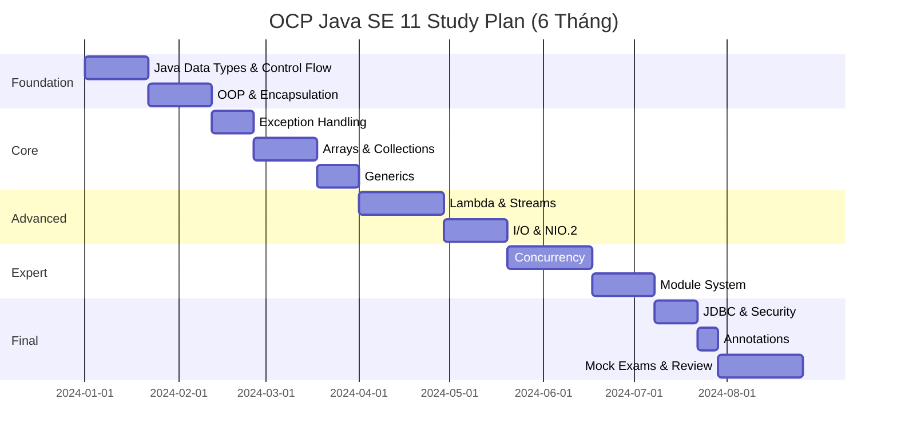
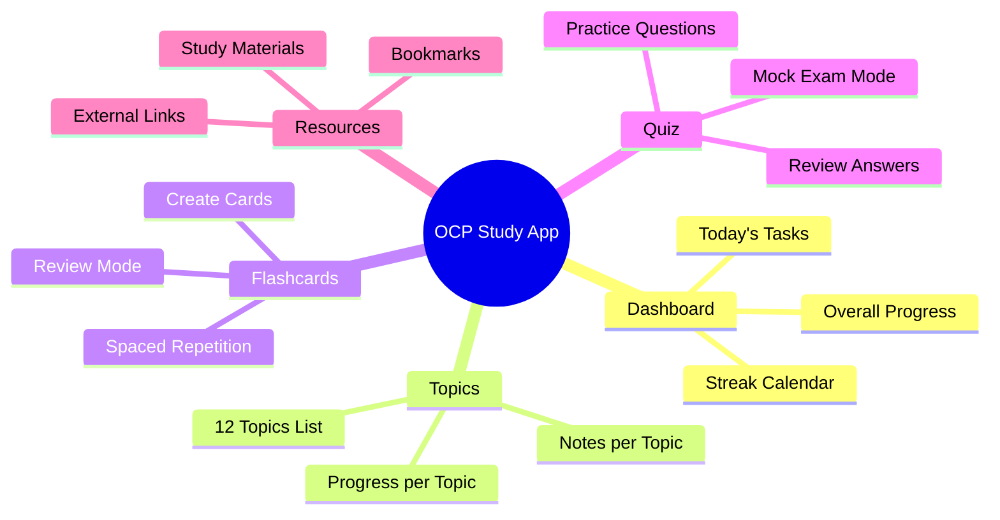
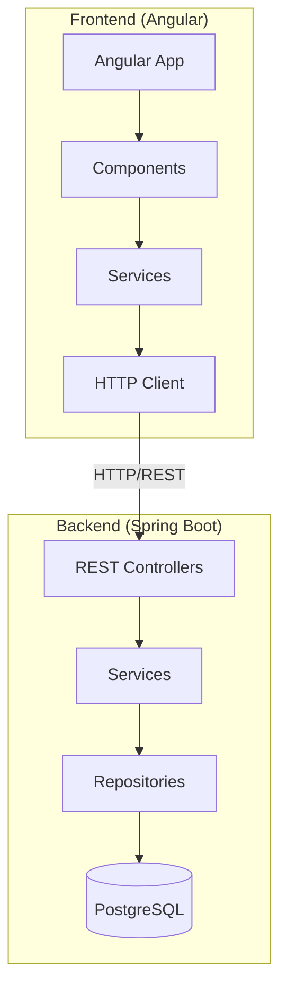
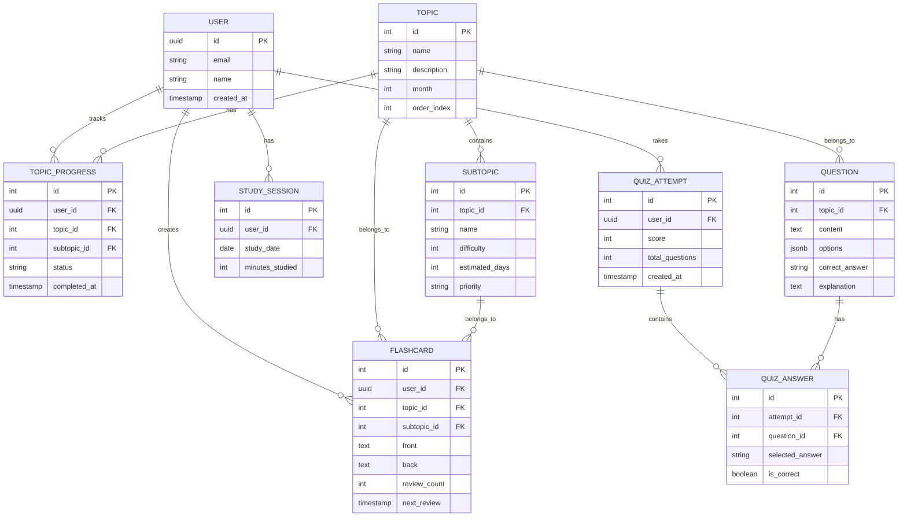

# OCP Java SE 11 Developer Study System

Xây dựng hệ thống học tập toàn diện cho chứng chỉ OCP Java SE 11 Developer (1Z0-819).

## Thông Tin Kỳ Thi

| Thông tin | Chi tiết |
|-----------|----------|
| **Exam Code** | 1Z0-819 |
| **Thời gian** | 90 phút |
| **Số câu hỏi** | 50 câu (Multiple Choice) |
| **Passing Score** | 68% (34/50 câu) |
| **Timeline học** | 6 tháng |
| **Kinh nghiệm** | 3 năm Java |

---

## Tech Stack Đã Xác Nhận

| Layer | Technology |
|-------|------------|
| **Frontend** | Angular 17+ (Standalone Components) |
| **Backend** | Spring Boot 3.x (Java 11+) |
| **Database** | PostgreSQL |
| **Styling** | SCSS + Angular Material hoặc Custom CSS |

> [!NOTE]
> **Backend Spring Boot** sẽ giúp bạn practice thêm Java trong quá trình ôn thi OCP!

---

## Phần 1: Study Curriculum (6 Tháng)

### Timeline Overview



### Chi Tiết Từng Topic

---

#### 📘 Tháng 1: Foundation (Tuần 1-4)

##### Topic 1: Working with Java Data Types
| Sub-topic | Độ khó | Thời gian | Ưu tiên |
|-----------|--------|-----------|---------|
| Primitives và Wrapper Classes | ⭐⭐ | 2 ngày | Cao |
| Operators, Promotion, Casting | ⭐⭐⭐ | 3 ngày | Cao |
| String và StringBuilder | ⭐⭐ | 2 ngày | Cao |
| Local Variable Type Inference (var) | ⭐⭐ | 1 ngày | Trung bình |

**Tài liệu đề xuất:**
- OCP Oracle Certified Professional Java SE 11 Developer Complete Study Guide (Sybex)
- Enthuware Mock Tests

##### Topic 2: Controlling Program Flow
| Sub-topic | Độ khó | Thời gian | Ưu tiên |
|-----------|--------|-----------|---------|
| if/else, switch statements | ⭐ | 1 ngày | Trung bình |
| Loops (for, while, do-while) | ⭐ | 1 ngày | Trung bình |
| break, continue, labels | ⭐⭐ | 1 ngày | Cao |

---

#### 📗 Tháng 2: OOP Deep Dive (Tuần 5-8)

##### Topic 3: Java Object-Oriented Approach
| Sub-topic | Độ khó | Thời gian | Ưu tiên |
|-----------|--------|-----------|---------|
| Classes, Objects, Constructors | ⭐⭐ | 3 ngày | Cao |
| Inheritance, Polymorphism | ⭐⭐⭐ | 4 ngày | Rất cao |
| Abstract Classes vs Interfaces | ⭐⭐⭐ | 3 ngày | Rất cao |
| Encapsulation, Immutability | ⭐⭐ | 2 ngày | Cao |
| Nested Classes (Inner, Static, Local, Anonymous) | ⭐⭐⭐ | 3 ngày | Cao |
| Enumerations | ⭐⭐ | 2 ngày | Trung bình |
| Functional Interfaces | ⭐⭐⭐ | 3 ngày | Rất cao |

---

#### 📙 Tháng 3: Collections & Exceptions (Tuần 9-12)

##### Topic 4: Exception Handling
| Sub-topic | Độ khó | Thời gian | Ưu tiên |
|-----------|--------|-----------|---------|
| try/catch/finally | ⭐⭐ | 2 ngày | Cao |
| try-with-resources | ⭐⭐⭐ | 2 ngày | Rất cao |
| Multi-catch | ⭐⭐ | 1 ngày | Cao |
| Custom Exceptions | ⭐⭐ | 1 ngày | Trung bình |
| Assertions | ⭐ | 1 ngày | Thấp |

##### Topic 5: Arrays and Collections
| Sub-topic | Độ khó | Thời gian | Ưu tiên |
|-----------|--------|-----------|---------|
| Arrays | ⭐⭐ | 2 ngày | Cao |
| List, Set, Map, Deque | ⭐⭐⭐ | 4 ngày | Rất cao |
| Generics & Wildcards | ⭐⭐⭐⭐ | 4 ngày | Rất cao |
| Comparator & Comparable | ⭐⭐⭐ | 2 ngày | Cao |
| Collection Convenience Methods | ⭐⭐ | 1 ngày | Trung bình |

---

#### 📕 Tháng 4: Streams & Functional Programming (Tuần 13-16)

##### Topic 6: Lambda Expressions & Streams
| Sub-topic | Độ khó | Thời gian | Ưu tiên |
|-----------|--------|-----------|---------|
| Lambda Syntax & Built-in Functional Interfaces | ⭐⭐⭐ | 4 ngày | Rất cao |
| Stream Pipeline (filter, map, reduce) | ⭐⭐⭐⭐ | 5 ngày | Rất cao |
| Collectors & Grouping | ⭐⭐⭐⭐ | 4 ngày | Rất cao |
| Parallel Streams | ⭐⭐⭐ | 3 ngày | Cao |
| Optional Class | ⭐⭐⭐ | 2 ngày | Cao |

---

#### 📓 Tháng 5: I/O, Concurrency & Modules (Tuần 17-20)

##### Topic 7: Java I/O API
| Sub-topic | Độ khó | Thời gian | Ưu tiên |
|-----------|--------|-----------|---------|
| I/O Streams (Byte & Character) | ⭐⭐⭐ | 3 ngày | Cao |
| Serialization/Deserialization | ⭐⭐⭐ | 2 ngày | Cao |
| java.nio.file API (Path, Files) | ⭐⭐⭐ | 3 ngày | Rất cao |

##### Topic 8: Concurrency
| Sub-topic | Độ khó | Thời gian | Ưu tiên |
|-----------|--------|-----------|---------|
| Threads, Runnable, Callable | ⭐⭐⭐ | 3 ngày | Cao |
| ExecutorService | ⭐⭐⭐ | 3 ngày | Rất cao |
| Synchronization & Locks | ⭐⭐⭐⭐ | 4 ngày | Rất cao |
| Concurrent Collections | ⭐⭐⭐ | 2 ngày | Cao |
| Atomic Variables | ⭐⭐⭐ | 2 ngày | Cao |

##### Topic 9: Java Platform Module System
| Sub-topic | Độ khó | Thời gian | Ưu tiên |
|-----------|--------|-----------|---------|
| module-info.java | ⭐⭐⭐ | 2 ngày | Cao |
| exports, requires, provides, uses | ⭐⭐⭐ | 3 ngày | Cao |
| Automatic & Unnamed Modules | ⭐⭐⭐ | 2 ngày | Cao |

---

#### 📔 Tháng 6: Final Topics & Mock Exams (Tuần 21-24)

##### Topic 10: JDBC
| Sub-topic | Độ khó | Thời gian | Ưu tiên |
|-----------|--------|-----------|---------|
| Connection, Statement, PreparedStatement | ⭐⭐ | 2 ngày | Cao |
| ResultSet | ⭐⭐ | 2 ngày | Cao |
| Transactions | ⭐⭐ | 1 ngày | Trung bình |

##### Topic 11: Secure Coding
| Sub-topic | Độ khó | Thời gian | Ưu tiên |
|-----------|--------|-----------|---------|
| Input Validation | ⭐⭐ | 1 ngày | Trung bình |
| Denial of Service Prevention | ⭐⭐ | 1 ngày | Trung bình |
| Resource Access Security | ⭐⭐ | 1 ngày | Trung bình |

##### Topic 12: Annotations
| Sub-topic | Độ khó | Thời gian | Ưu tiên |
|-----------|--------|-----------|---------|
| Built-in Annotations | ⭐⭐ | 1 ngày | Trung bình |
| Custom Annotations | ⭐⭐ | 1 ngày | Trung bình |
| Annotation Processing | ⭐⭐ | 1 ngày | Thấp |

##### 🎯 Mock Exams & Review (2 tuần cuối)
- Enthuware Mock Tests (5-6 full tests)
- Whizlabs Practice Tests
- Review weak areas
- Time management practice

---

## Phần 2: Web Application

### Proposed Features



### Tech Stack Chi Tiết

| Layer | Technology | Chi tiết |
|-------|------------|----------|
| **Frontend** | Angular 17+ | Standalone Components, Signals |
| **Styling** | SCSS + Custom CSS | Premium dark theme |
| **State** | Angular Signals + Services | Reactive state management |
| **Backend** | Spring Boot 3.2 | REST API, Java 11+ |
| **ORM** | Spring Data JPA | Hibernate |
| **Database** | PostgreSQL 15+ | Relational data |
| **Icons** | Material Icons / Lucide | Modern iconography |

### System Architecture



### Database Schema



### Proposed File Structure

```
d:\www\ocp\
├── frontend/                          # Angular Application
│   ├── angular.json
│   ├── package.json
│   ├── tsconfig.json
│   └── src/
│       ├── main.ts
│       ├── index.html
│       ├── styles.scss                # Global styles + Design tokens
│       └── app/
│           ├── app.component.ts
│           ├── app.routes.ts
│           ├── app.config.ts
│           ├── core/
│           │   ├── services/
│           │   │   ├── api.service.ts
│           │   │   ├── auth.service.ts
│           │   │   └── study.service.ts
│           │   ├── interceptors/
│           │   │   └── auth.interceptor.ts
│           │   └── guards/
│           │       └── auth.guard.ts
│           ├── shared/
│           │   ├── components/
│           │   │   ├── header/
│           │   │   ├── sidebar/
│           │   │   ├── card/
│           │   │   └── modal/
│           │   └── pipes/
│           ├── features/
│           │   ├── dashboard/
│           │   │   ├── dashboard.component.ts
│           │   │   ├── progress-card/
│           │   │   ├── streak-calendar/
│           │   │   └── today-tasks/
│           │   ├── topics/
│           │   │   ├── topic-list/
│           │   │   └── topic-detail/
│           │   ├── flashcards/
│           │   │   ├── flashcard-list/
│           │   │   ├── flashcard-form/
│           │   │   └── flashcard-review/
│           │   └── quiz/
│           │       ├── quiz-start/
│           │       ├── quiz-question/
│           │       └── quiz-result/
│           └── models/
│               ├── topic.model.ts
│               ├── flashcard.model.ts
│               └── quiz.model.ts
│
├── backend/                           # Spring Boot Application
│   ├── pom.xml
│   └── src/
│       └── main/
│           ├── java/com/ocp/study/
│           │   ├── OcpStudyApplication.java
│           │   ├── config/
│           │   │   ├── SecurityConfig.java
│           │   │   └── CorsConfig.java
│           │   ├── controller/
│           │   │   ├── TopicController.java
│           │   │   ├── FlashcardController.java
│           │   │   ├── QuizController.java
│           │   │   └── ProgressController.java
│           │   ├── service/
│           │   │   ├── TopicService.java
│           │   │   ├── FlashcardService.java
│           │   │   ├── QuizService.java
│           │   │   └── ProgressService.java
│           │   ├── repository/
│           │   │   ├── TopicRepository.java
│           │   │   ├── FlashcardRepository.java
│           │   │   ├── QuestionRepository.java
│           │   │   └── ProgressRepository.java
│           │   ├── entity/
│           │   │   ├── Topic.java
│           │   │   ├── Subtopic.java
│           │   │   ├── Flashcard.java
│           │   │   ├── Question.java
│           │   │   └── TopicProgress.java
│           │   └── dto/
│           │       ├── TopicDTO.java
│           │       ├── FlashcardDTO.java
│           │       └── QuizDTO.java
│           └── resources/
│               ├── application.yml
│               └── db/migration/      # Flyway migrations
│                   ├── V1__create_tables.sql
│                   └── V2__seed_topics.sql
│
└── docker-compose.yml                 # PostgreSQL + Backend setup
```

### API Endpoints

| Method | Endpoint | Description |
|--------|----------|-------------|
| GET | `/api/topics` | Lấy danh sách topics |
| GET | `/api/topics/{id}` | Lấy chi tiết topic |
| GET | `/api/progress` | Lấy tiến độ học |
| POST | `/api/progress` | Cập nhật tiến độ |
| GET | `/api/flashcards` | Lấy flashcards |
| POST | `/api/flashcards` | Tạo flashcard mới |
| PUT | `/api/flashcards/{id}` | Cập nhật flashcard |
| DELETE | `/api/flashcards/{id}` | Xóa flashcard |
| GET | `/api/quiz/questions` | Lấy câu hỏi quiz |
| POST | `/api/quiz/submit` | Nộp bài quiz |
| GET | `/api/quiz/history` | Lịch sử làm quiz |
| GET | `/api/stats/dashboard` | Dữ liệu dashboard |

---

## Verification Plan

### Development Verification
1. **Backend Build**: `mvn clean package` phải pass
2. **Frontend Build**: `ng build --configuration=production` phải pass
3. **Database**: PostgreSQL migrations chạy thành công
4. **API Test**: Postman/REST Client test các endpoints

### Feature Verification
- [ ] Dashboard hiển thị đúng progress từ database
- [ ] Có thể mark topic/subtopic là complete
- [ ] CRUD Flashcards hoạt động đúng
- [ ] Quiz mode tính điểm chính xác và lưu history
- [ ] Streak calendar hiển thị đúng study sessions

---

## Proposed Changes

### [NEW] Angular Frontend Project

#### [NEW] [frontend/package.json](file:///d:/www/ocp/frontend/package.json)
- Angular 17+ với standalone components

#### [NEW] [frontend/src/styles.scss](file:///d:/www/ocp/frontend/src/styles.scss)
- Design system với SCSS variables
- Dark mode by default
- Premium, modern aesthetics

#### [NEW] Component files
- Dashboard, Topics, Flashcards, Quiz components

---

### [NEW] Spring Boot Backend Project

#### [NEW] [backend/pom.xml](file:///d:/www/ocp/backend/pom.xml)
- Spring Boot 3.2, Spring Data JPA, PostgreSQL driver

#### [NEW] [backend/src/main/resources/application.yml](file:///d:/www/ocp/backend/src/main/resources/application.yml)
- Database configuration, CORS settings

#### [NEW] Entity, Repository, Service, Controller files
- Full CRUD cho Topics, Flashcards, Quiz, Progress

---

### [NEW] Database Setup

#### [NEW] [docker-compose.yml](file:///d:/www/ocp/docker-compose.yml)
- PostgreSQL container setup

#### [NEW] Flyway Migrations
- Schema creation và seed data cho 12 OCP topics

---

## Tài Liệu Học Đề Xuất

### Sách
1. **OCP Oracle Certified Professional Java SE 11 Developer Complete Study Guide** - Sybex (Jeanne Boyarsky & Scott Selikoff) ⭐⭐⭐⭐⭐
2. **OCP Java SE 11 Programmer II Study Guide** - Sybex

### Online Courses
1. **Udemy**: Java SE 11 Developer 1Z0-819 OCP Course
2. **Whizlabs**: Oracle Java SE 11 Certification

### Practice Tests
1. **Enthuware** - Best value, closest to real exam ⭐⭐⭐⭐⭐
2. **Whizlabs Practice Tests**

### Free Resources
- Oracle Java Tutorials (docs.oracle.com)
- Baeldung (baeldung.com)
